# Neural spike sorting and decoding

Spike sorting from raw extracellular voltage, then population-level
decoding of object category, on single-unit and LFP recordings from macaque
inferior temporal (IT) cortex.

Three notebooks, each standalone:

| Notebook | What it does |
|---|---|
| [`01_spike_sorting.ipynb`](notebooks/01_spike_sorting.ipynb) | Filtering, MAD threshold detection, waveform extraction, PCA/t-SNE, K-means, cluster quality without ground truth |
| [`02_population_decoding.ipynb`](notebooks/02_population_decoding.ipynb) | PSTH, Fano factor, SVM decoding over time, temporal generalisation, mutual information, d-prime, RSA |
| [`03_lfp_phase_amplitude_coupling.ipynb`](notebooks/03_lfp_phase_amplitude_coupling.ipynb) | Theta–gamma phase–amplitude coupling by stimulus category, Welch spectra |

The full write-up is in [`docs/report.md`](docs/report.md).

---

## 1 — Spike sorting

30 kHz extracellular recording, 2,390 s. Band-pass or high-pass Butterworth
with `filtfilt`, threshold at a multiple of the MAD noise estimate
`σₙ = median(|x|) / 0.6745`, peak detection with a 1 ms refractory
constraint, ±2 ms waveform windows, PCA and t-SNE, K-means over k = 2…5.

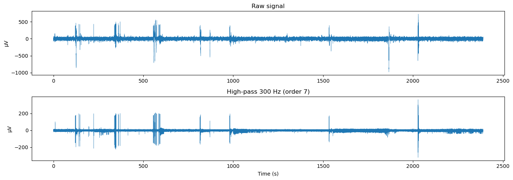

σₙ = 2.707 µV gives a threshold of 13.533 µV and 31,064 detected events
(8,999 positive-going, 22,065 negative-going). The first three principal
components of the 31,064 × 120 waveform matrix carry 30.4%, 21.4% and 10.0%
of the variance.

| | |
|---|---|
| 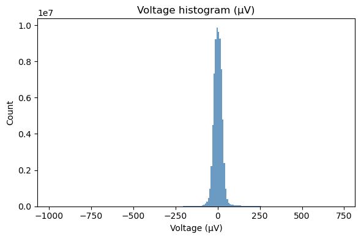 | 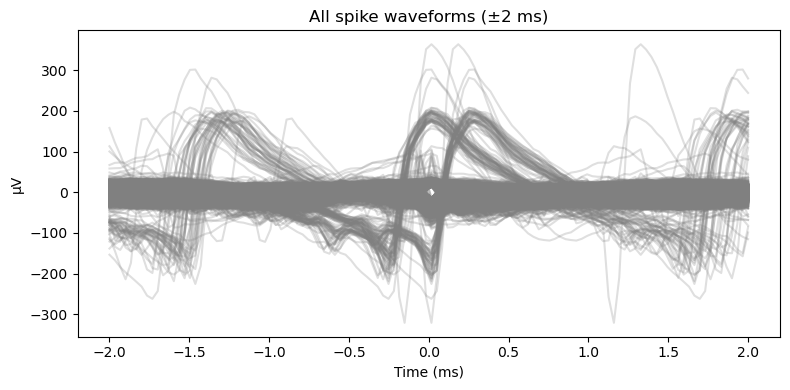 |
| 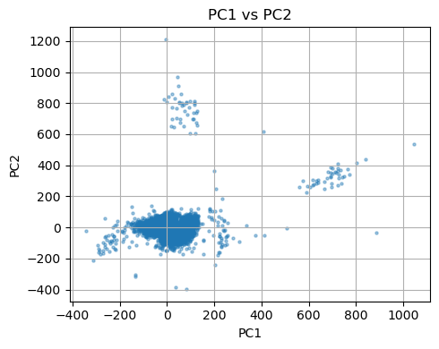 | 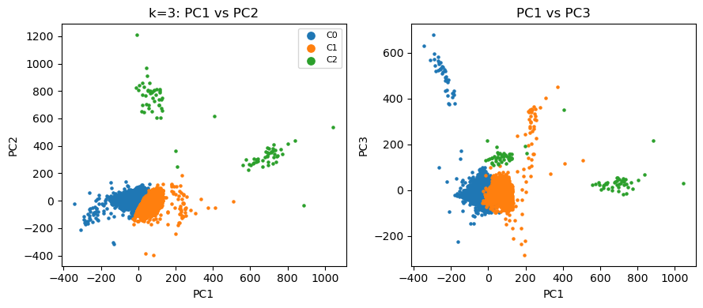 |
| 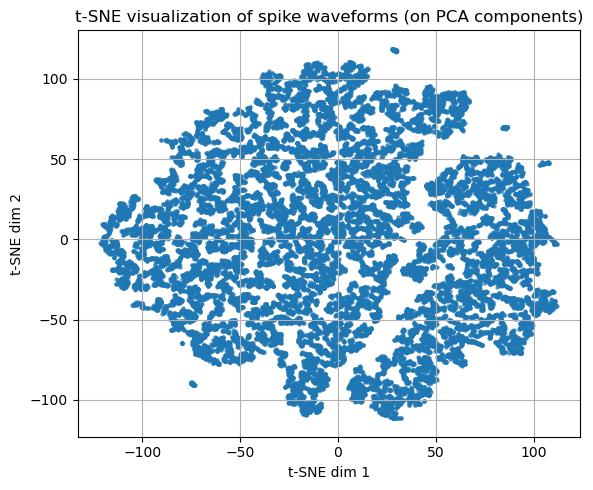 | 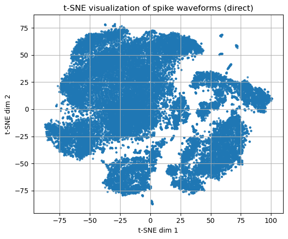 |
| 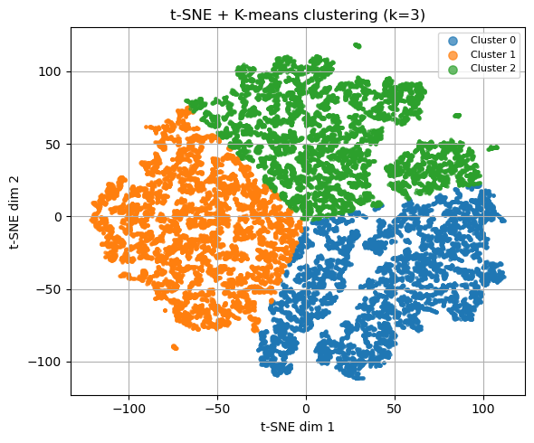 | |

**The supplied reference file is not a spike train.** `Spikes (1).mat`
contains one array of 90,789 strictly increasing unique integers, of which
73.7% of consecutive differences are exactly 1, covering 65.4% of the range
1…138,879 and ending exactly at 138,879. A spike train over this recording
at 1 kHz would span ~2.39 million samples and could not have one-sample
gaps three quarters of the time — it is a selection index into a list that
is not in the file. Every "match" against it falls inside the first 138.9 s
of a 2,390 s recording, and a random integer in that range scores about as
well. The reported F1 of 0.018 describes integer collisions.

The notebook keeps that calculation (the report quotes it) with the
diagnostics beside it, and measures sorting quality the way it can be
measured without ground truth:

| all detections | those "matching" the reference |
|---|---|
| 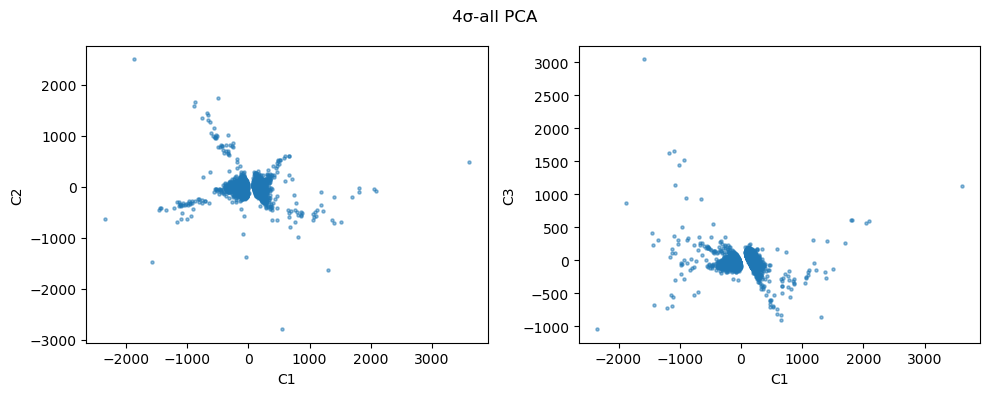 | 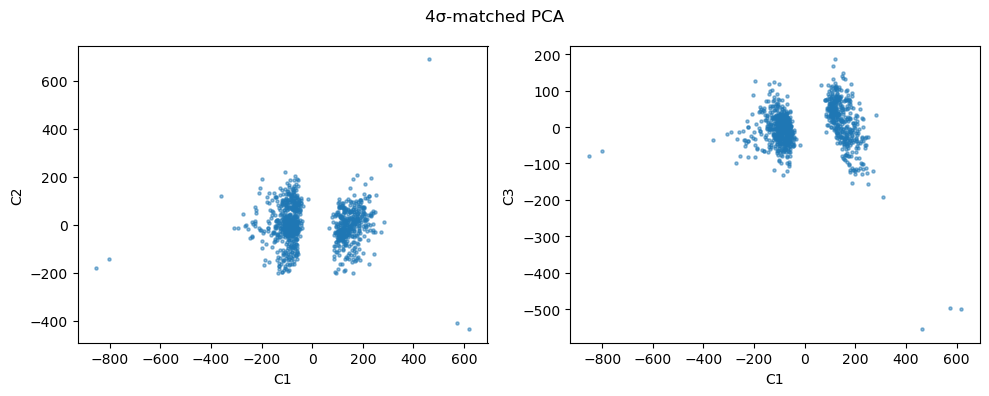 |

| k = 3 cluster | events | ISI < 2 ms | reading |
|---|---|---|---|
| 1 | 22,286 | 5.8% | plausible unit |
| 2 | 8,692 | 6.2% | plausible unit |
| 3 | 86 | 49.4% | not a unit |

Silhouette in PCA space 0.525; amplitude SNR 6.87.

## 2 — Population decoding

92 IT neurons, 500 images presented ~10 times each, in four categories by
stimulus code: face (1–200), body (201–320), natural (321–390), artificial
(391–500).

Three representative single-neuron PSTHs, by category:

| | | |
|---|---|---|
| 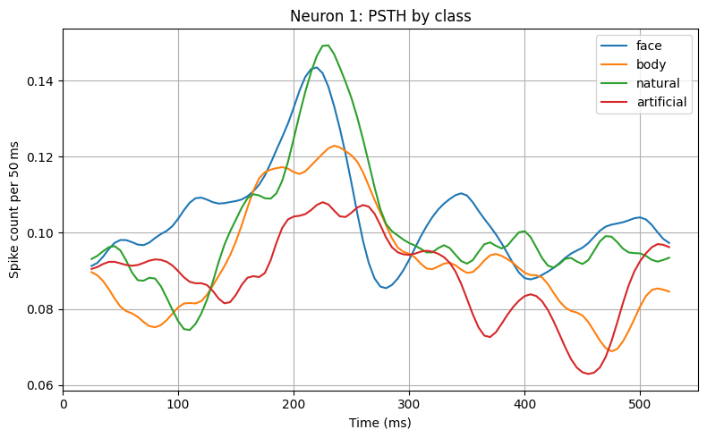 | 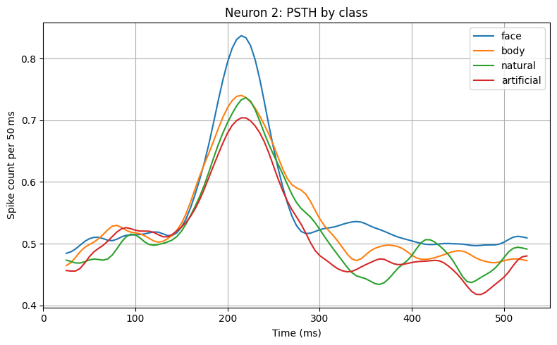 | 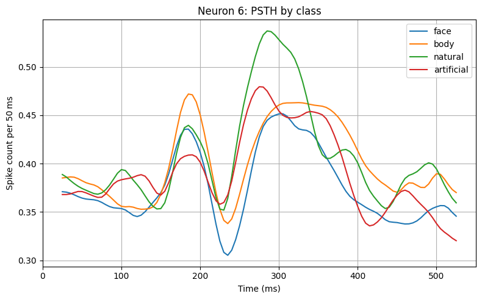 |

| | |
|---|---|
| 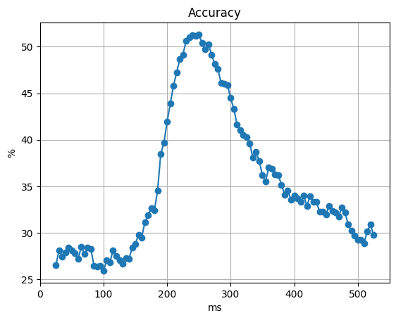 | 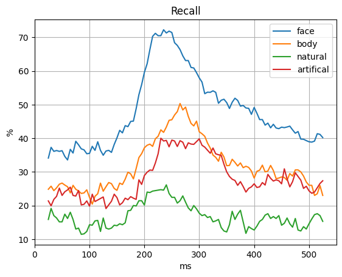 |
| 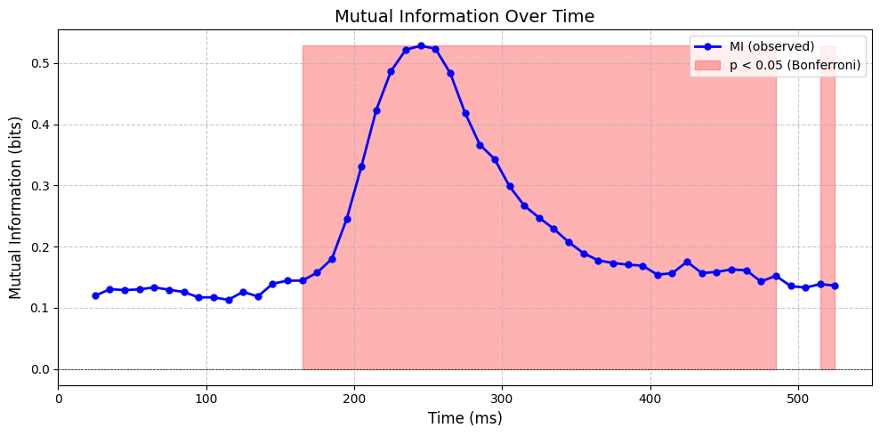 | 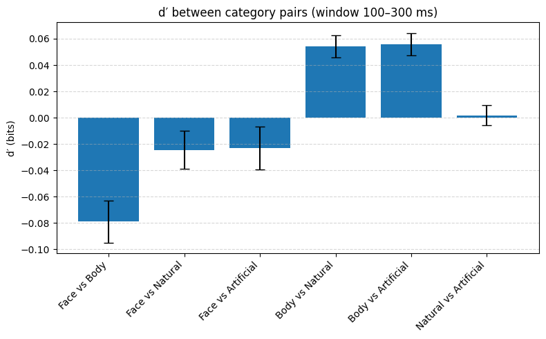 |
| 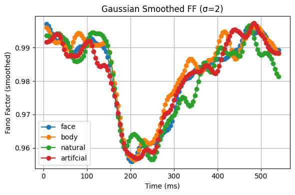 | 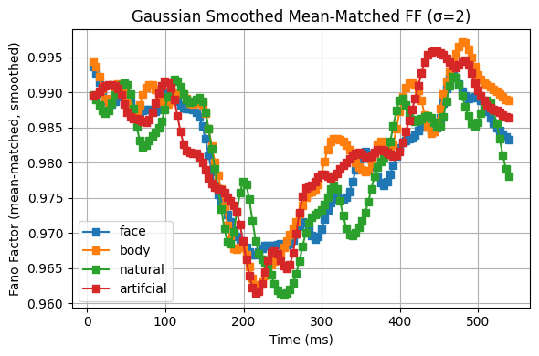 |

Category information peaks 200–300 ms after stimulus onset — the decoding
curve, the mutual-information curve and the Fano-factor drop all place it
there, and the RSA time course agrees.

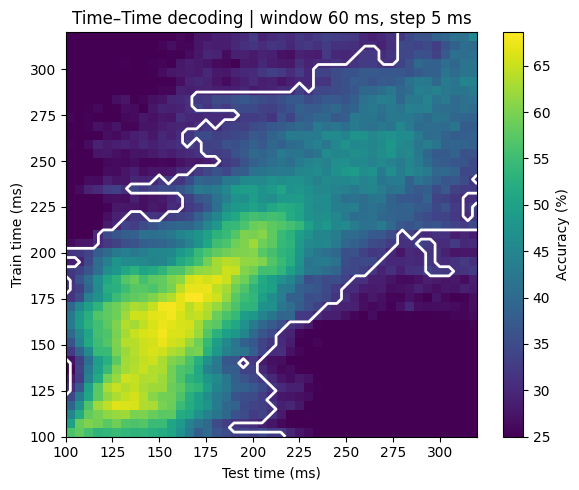

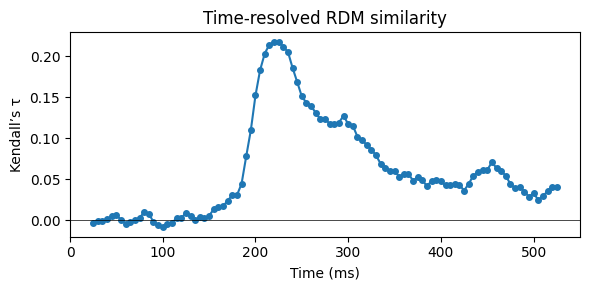

The neural RDM beside the category model it is scored against:

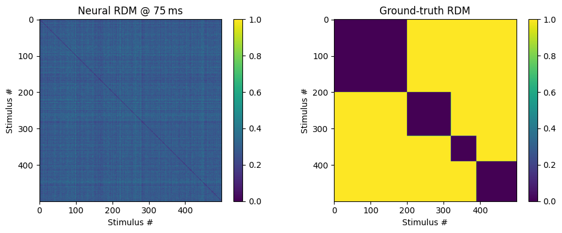

## 3 — LFP phase–amplitude coupling

LFPs from 17 sessions. Tort MI (`idpac=(2,0,0)`) and Canolty MVL
(`idpac=(1,0,0)`) over a 4–20 Hz phase band and a 30–130 Hz amplitude band,
per stimulus category, with Welch spectra alongside.

| | |
|---|---|
| 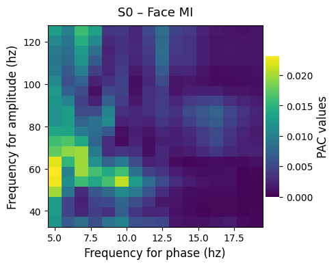 | 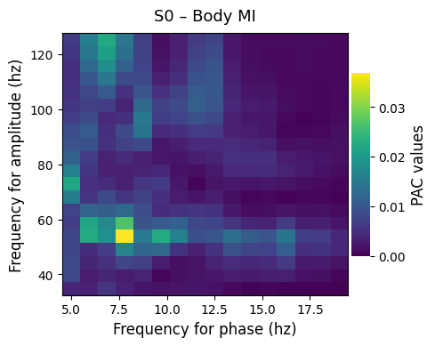 |
| 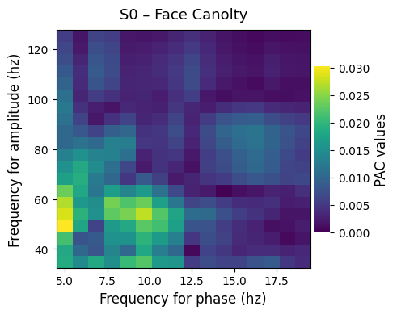 | |
| 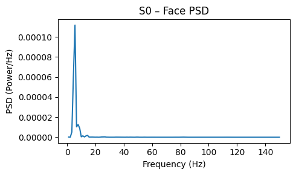 | 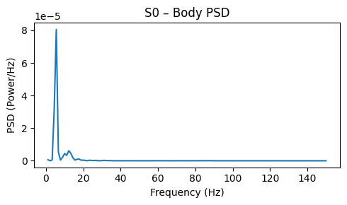 |

The two estimators disagree because they measure different things: Tort MI
is the divergence of the amplitude-by-phase histogram from uniform, scaled
and independent of absolute power, while Canolty MVL is the mean of
amplitude × phase and scales with it.

---

## What was corrected

The notebooks are the original analysis code with the defects found while
rebuilding it fixed in place and documented at the point of the fix, rather
than rewritten. The substantive ones:

- **Only positive peaks were detected.** IT action potentials here are
  mostly negative-going; detecting both polarities raises the count from
  8,999 to 31,064, so about 71% of events were being discarded.
- **Every latency in the time–time decoding figure was 100 ms early.** Bin
  offsets were counted from the start of the cropped epoch and the 100 ms
  crop was never added back. The figure labelled 100–320 ms shows
  200–420 ms — the difference between category information appearing before
  100 ms and appearing after 200 ms.
- **PAC was computed on the trial-averaged LFP.** Trial averaging keeps
  only the phase-locked component, and gamma amplitude is largely induced,
  so most of the measured signal was being removed. PAC is now computed per
  trial and the maps averaged.
- **The standardiser saw the test folds.** Each time slice was standardised
  before cross-validation; the scaler is now fitted inside each fold.
- **Chance was drawn at 25%.** With 200/120/70/110 images per category, a
  classifier that always answers *face* scores 40%. The baseline is now the
  majority-class rate.
- **`0.9 × max|x|` as a detection threshold** selects the single largest
  sample in the recording by construction — it detects exactly one event.
  Kept, documented, and joined by an 8σ arm for the liberal-vs-conservative
  comparison the section was reaching for.
- **Permutation p-values had no headroom.** `mean(null >= obs)` returns
  exactly 0, and with 1000 permutations the resolution (10⁻³) was the same
  order as the Bonferroni threshold (9.8 × 10⁻⁴). Now the add-one
  estimator, with the required permutation count stated.
- **Accumulated PAC results were never plotted.** 17 sessions were
  collected and discarded; the grand average is added.
- **The RDM grid showed half the window in its title.** Bins were selected
  on a 5 ms grid and truncated to the 16 available panels, so
  "150–300 ms in 10 ms bins" was really 150–225 ms.

Also: seven near-duplicate copies of the loader, PSTH and stimulus mapping
collapsed into one shared setup cell; Persian narration translated;
per-neuron plotting loops capped at a few representative neurons; results
written to `results/` instead of the working directory.

## Running it

```bash
pip install -r requirements.txt
jupyter lab notebooks/
```

The recordings are hundreds of megabytes and are not committed. Put them in
`./data/`, or point the `SPIKE_DATA_DIR` environment variable at wherever
they live:

| File | Needed by |
|---|---|
| `singleIT.mat` | notebook 1 |
| `Spikes (1).mat` | notebook 1 |
| `dataVasati.mat` | notebook 2 |
| `data_LFP.mat` | notebook 3 |

Two settings are worth knowing before a full run: `N_PERM = 500` in the
temporal-generalisation cell takes roughly 40 minutes on eight cores, and
`SURROGATES = True` in notebook 3 takes about an hour. Both are commented
where they are set.

## Licence

MIT — see [LICENSE](LICENSE).
